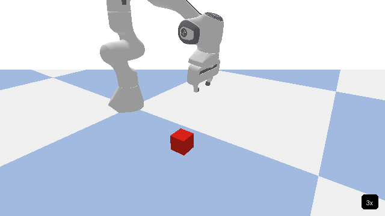
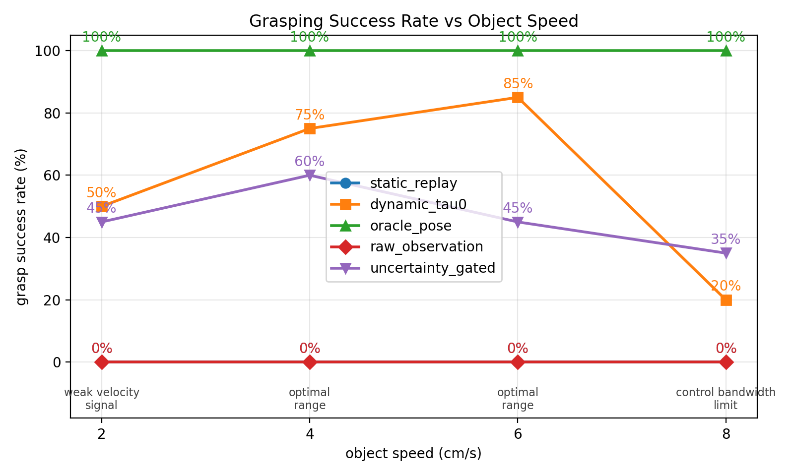

# MT3 动态对准

面向移动物体的连续目标跟踪与延迟补偿 demo replay，使静态物体上的 MT3 示教可以迁移到运动物体。

> **状态：** PyBullet 仿真研究已完成。五条件 ablation（static_replay、raw_observation、dynamic_tau0、uncertainty_gated、oracle_pose）已在 4 个速度 × 20 次试验上验证。Sawyer + RealSense D415 硬件验证是下一步。

## Demo



Franka Panda 使用静态物体上的抓取示教，在桌面移动物体上完成 replay。整个过程不需要重新训练。

## 核心公式

```text
T_WE_target(t) = T_delta(t + tau) · T_WE_demo(t)
```

`T_WE_demo(t)` 是 MT3 在静态物体上记录的末端执行器位姿序列。`T_delta(t + tau)` 是物体运动的延迟补偿预测，因此机器人执行的是移动物体坐标系下的原始示教，而不是追逐已经过时的观测位置。

## 关键结果



当前 PyBullet ablation 使用五个条件，在四个物体速度上分别进行 20 次试验。`static_replay` 在所有速度下成功率均为 0%，说明直接把静态物体示教 replay 到移动物体上确实会失败。`dynamic_tau0` 在 2-6 cm/s 下达到 70-85% 成功率，在 8 cm/s 下降到 25%。`oracle_pose` 在所有速度下达到 100%，说明控制器不是瓶颈。`raw_observation` 成功率为 0%，说明 Kalman 滤波是必要的。`uncertainty_gated` 在仿真中与 `dynamic_tau0` 表现接近；PyBullet 中协方差矩阵接近常量，因此需要真实硬件来区分二者。

## 工作原理

Tracker 估计物体相对于静态示教时的位置变化。Kalman 滤波器对这个运动估计进行平滑，并向未来预测一小段时间，用来补偿相机、计算和执行延迟。机器人随后用预测出的物体运动去变换每一帧 demo 位姿，因此同一段示教可以跟随移动物体执行。对于抓取任务，自适应 replay 会在对准较差时放慢 demo，等手臂重新对准后再继续执行。

## 模块结构

```text
MT3_dynamic_alignment/
├── dynamic_alignment/          核心实现
│   ├── types.py                共享数据结构
│   ├── motion_models.py        常速度与协调转弯运动模型
│   ├── kalman.py               Kalman / EKF 滤波器
│   ├── pose_estimator.py       点云到物体运动观测
│   └── tracker.py              主跟踪与目标位姿接口
│
├── examples/
│   └── simulate_and_plot.py    最小合成仿真示例
│
├── simulation/                 PyBullet 实验
│   ├── dev/                    开发与诊断脚本，02-09_*.py
│   ├── 10_grasping_experiment.py
│   └── results/
│       ├── canonical/          带时间戳的 ablation 运行，每个目录包含 command.txt、config.json、raw_trials.csv 和图表
│       └── plot/               图表与 demo GIF
│
├── tests/                      无硬件依赖的单元测试
├── MT3_dynamic_alignment_notes.md
└── 2511.10110v1.pdf            MT3 论文
```

## 快速开始

创建环境：

```bash
conda create -n dynamic_mt3 python=3.11 numpy matplotlib pytest -y
conda activate dynamic_mt3
```

运行测试：

```bash
python -m pytest tests/ -v
```

运行最小仿真示例：

```bash
python examples/simulate_and_plot.py
```

PyBullet 实验还需要在同一环境中安装 `pybullet`、`pillow` 和 `imageio`。

## 与 MT3 集成

真实部署只需要替换两个感知 stub，并在控制器中切换目标位姿来源。

```python
# 1. 替换 pose_estimator.py 中的硬件 stub
PoseEstimator.get_point_cloud_from_realsense()   # RealSense SDK
PoseEstimator.segment_object_by_bbox()           # MT3 点云分割

# 2. 在 MT3/GICP 对准完成后初始化一次
tracker.init(current_cloud, initial_theta=gicp_theta, timestamp=t0)

# 3. 在控制循环中使用动态目标位姿
state = tracker.update(current_cloud, timestamp=t)
T_target = tracker.get_target_pose(demo_data, t_demo=phase_time, tau=0.1)
```

MT3 原有 demo 数据格式可以保持不变：`DemoData` 继续保存原始末端执行器位姿序列和时间戳。

## 设计说明

推导、延迟补偿分析、运动模型假设和两阶段 replay 设计见 [`MT3_dynamic_alignment_notes.md`](MT3_dynamic_alignment_notes.md)。

## 致谢

本项目研究如何将 MT3（Multi-Task Trajectory Transfer，Science Robotics 2025）的 demo replay 从静态物体扩展到缓慢移动的桌面物体，使用单个示教且不进行重新训练。
