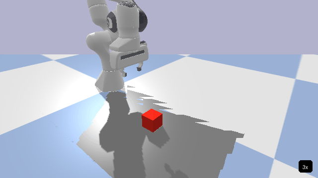
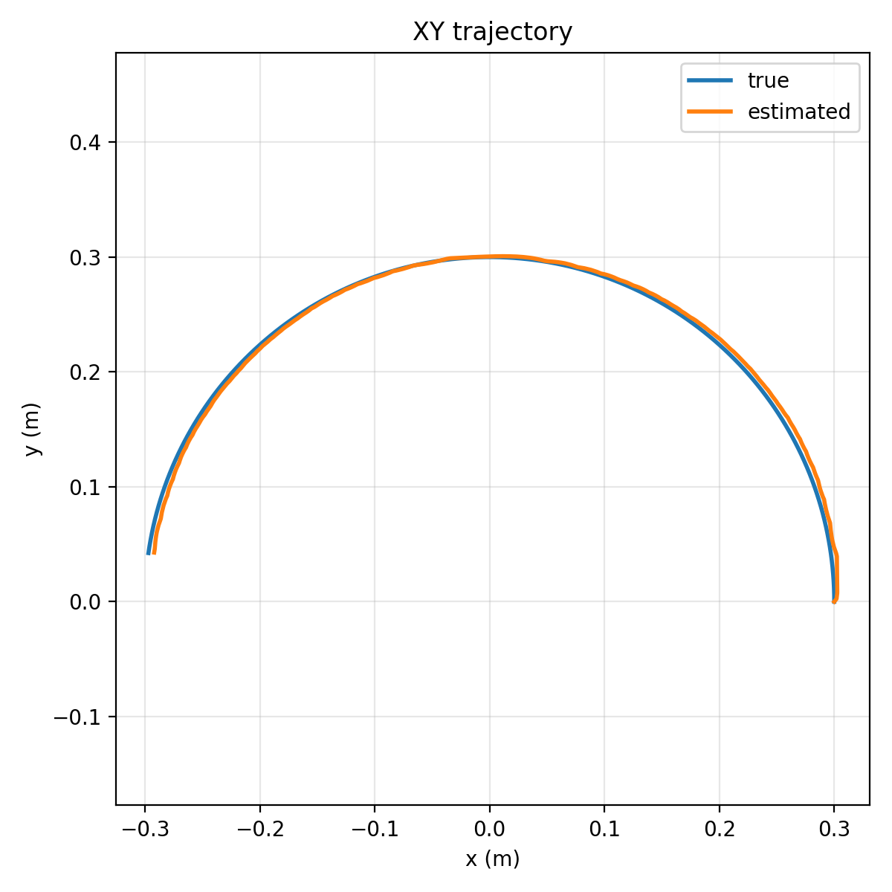
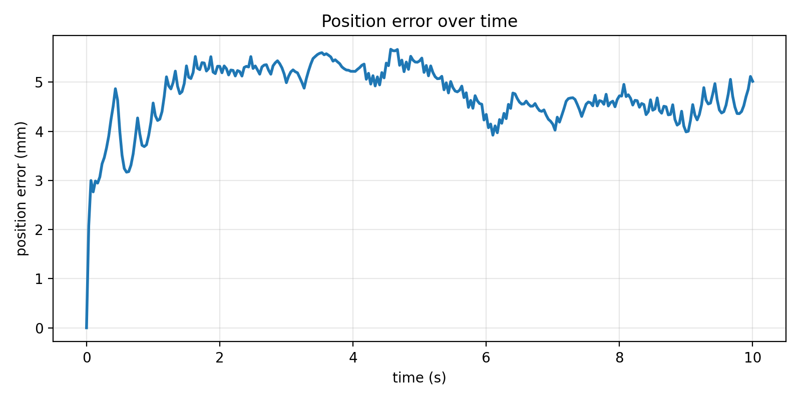
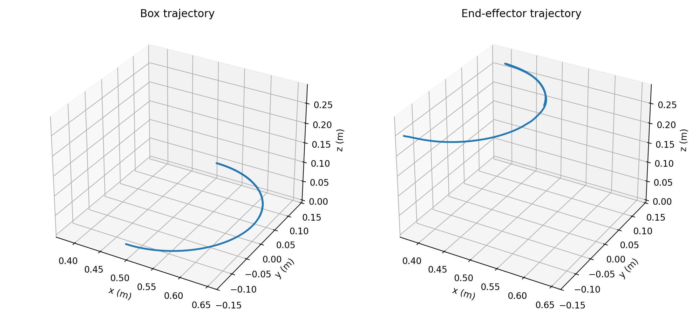
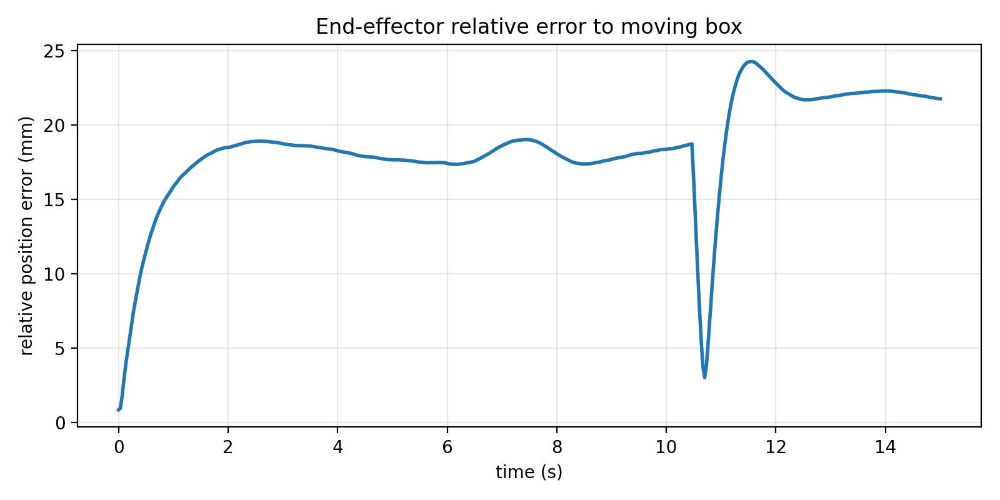
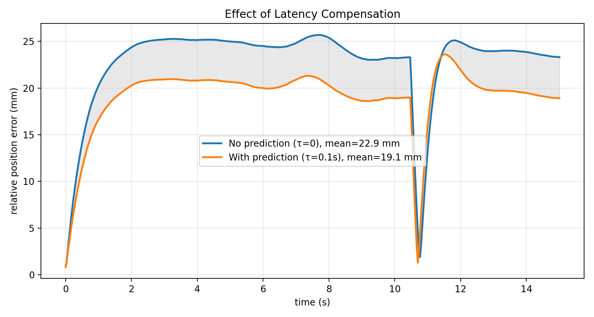
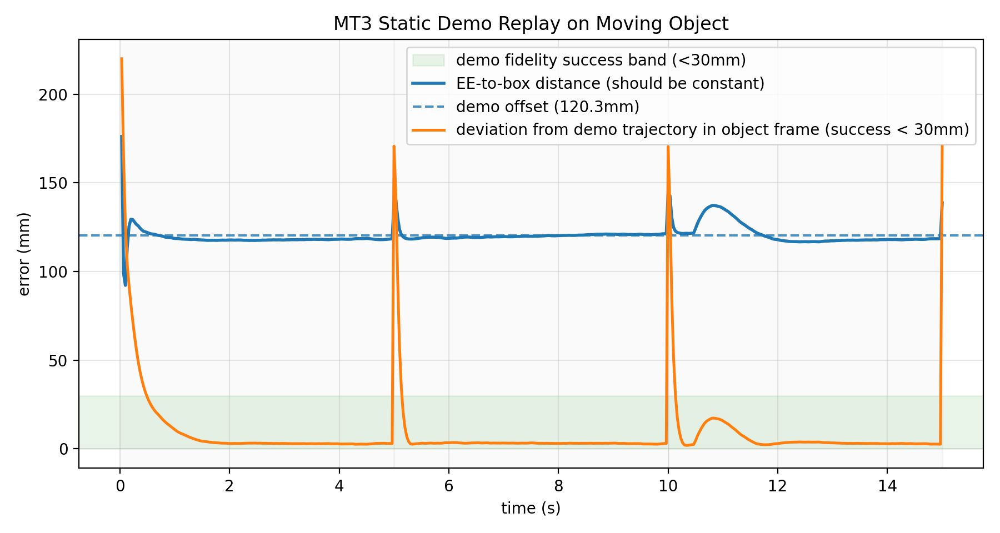
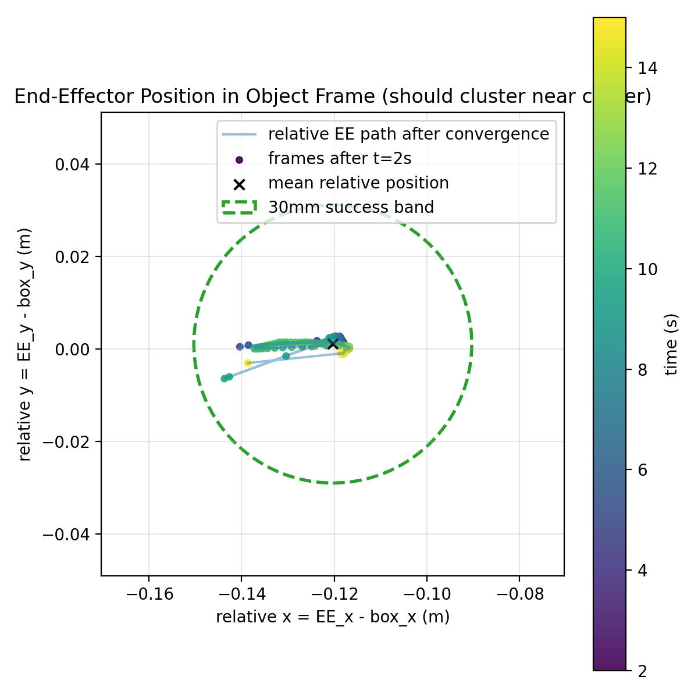

# MT3 动态对准扩展（Dynamic Alignment Extension）

> **状态**：核心算法已实现，并通过合成数据与 PyBullet 仿真验证。Sawyer + RealSense D415 硬件验证进行中。
>
> 将 MT3 的一次性静态 GICP 对准扩展为**连续追踪**，让机械臂用单次静态示教即可抓取移动物体。
>
> 硬件背景：Sawyer 7-DOF 机械臂 + RealSense D415（头部固定）。
> 纯 Python，无 ROS 依赖，无训练，全程解析可解释。

## 演示



*Franka Panda 末端跟踪移动方块（圆周轨迹，R=0.15m，ω=0.3 rad/s）。
稳态相对误差：约 20mm。无需重新训练。*

---

## 核心公式

```
T_WE_target(t) = T_δ(t + τ) · T_WE_demo(t)
```

| 符号 | 含义 |
|------|------|
| `T_δ(t)` | 当前帧物体相对 demo 参考帧的 SE(2) 变换（水平面：Δx, Δy, Δθ） |
| `T_WE_demo(t)` | MT3 录制的 demo 末端位姿序列 |
| `τ` | 系统总延迟（感知+计算+执行，默认 100ms） |

- **Alignment 阶段**：`T_WE_demo(t) = T_WE_demo(0)`（常数），末端跟随物体运动
- **Interaction 阶段**：`T_WE_demo(t)` 沿 demo 序列推进，在物体坐标系内重放示教动作
- **切换时刻**：两阶段目标相等，**连续无跳变**

---

## 模块结构

```
MT3_Plus/
├── dynamic_alignment/          核心实现（纯 NumPy，无硬件依赖）
│   ├── types.py                数据结构
│   ├── motion_models.py        运动模型（CV / CT）
│   ├── kalman.py               Kalman / EKF 滤波器
│   ├── pose_estimator.py       点云 → T_δ 原始观测（质心 + PCA）
│   └── tracker.py              主接口
│
├── tests/                      单元测试（合成数据，无硬件）
│   ├── helpers.py              合成点云 / 圆周轨迹生成工具
│   ├── conftest.py             pytest fixtures
│   ├── test_kalman.py          28 个用例
│   ├── test_pose_estimator.py  19 个用例
│   └── test_tracker.py         19 个用例
│
├── MT3_dynamic_alignment_notes.md   设计推导笔记
└── 2305.05926v1.pdf                 MT3 原论文
```

---

## 各模块说明

### `types.py` — 数据结构

| 类 | 字段 | 说明 |
|----|------|------|
| `ObjectObservation` | `delta_x/y/theta`, `timestamp`, `is_valid` | 点云估计器输出的单帧观测 |
| `TrackerState` | `x` (6,), `P` (6×6), `timestamp` | Kalman 均值 + 协方差 |
| `DemoData` | `poses`, `timestamps` | MT3 demo 位姿序列，支持线性插值 |

状态向量定义：`x = [Δx, Δy, Δθ, Δẋ, Δẏ, Δθ̇]`（水平面 6 维）

---

### `motion_models.py` — 运动模型

#### CVModel（匀速，默认）
线性模型，状态转移矩阵 F 与状态无关，标准 Kalman 直接适用。
过程噪声采用**离散白噪声加速度（DWNA）**标准形式。

对延迟补偿场景（τ ≈ 100ms，v < 10cm/s）残差约 0.5mm，完全充分。

#### CTModel（协调转弯）
适用于圆弧传送带、旋转工作台等匀速圆周运动场景。  
非线性状态转移（圆弧积分）：

```
Δx(t+dt) = Δx + (v/ω)·[sin(φ + ω·dt) − sin(φ)]
Δy(t+dt) = Δy − (v/ω)·[cos(φ + ω·dt) − cos(φ)]
```

Jacobian 用数值微分（步长 1e-6），供 EKF 协方差传播使用。  
`|ω| < ε` 时自动退化为 CV，避免 v/ω 奇异。

---

### `kalman.py` — Kalman / EKF 滤波器

三个核心方法：

```python
kf.predict(dt)          # 时间推进；更新内部状态
kf.update(obs)          # 融合观测；is_valid=False 时跳过
kf.predict_ahead(tau)   # 向前预测 τ 秒；不修改内部状态
```

- 协方差更新采用 **Joseph 稳定形式** `(I-KH)P(I-KH)ᵀ + KRKᵀ`，数值上始终保持正定
- 角度分量创新量归一化到 (−π, π]，防止 ±π 边界跳变
- 默认观测噪声：σ_xy = 4mm，σ_θ = 3°（对应 D415 精度）

**延迟补偿原理（`predict_ahead`）**：  
系统延迟 τ 使控制器执行"过去"的命令。`predict_ahead(τ)` 输出 τ 秒后的预测状态，
当 τ 等于实际系统延迟时，位置残差理论值 ≈ ½aτ² ≈ 0.5mm（10cm/s 场景）。

---

### `pose_estimator.py` — 点云位姿估计器

```
输入：分割后的物体点云 (N, 3)
输出：ObjectObservation [Δx, Δy, Δθ]
```

处理流程：

1. **水平面过滤**：保留 `|z − z_median| ≤ 0.05m` 的点，剔除背景散点
2. **质心** → `(Δx, Δy)`：mean(cloud[:, :2]) − ref_centroid，噪声 ~3.5mm
3. **PCA 主轴** → `Δθ`：协方差矩阵特征分解，取最大特征值对应轴
4. **180° 歧义消解**：与上一帧对比，选角度差最小的候选，利用帧间连续性唯一确定

硬件接口（`get_point_cloud_from_realsense`、`segment_object_by_bbox`）以 Stub 方式保留，
注释中给出实际部署替换代码。

---

### `tracker.py` — 主接口

```python
tracker = DynamicAlignmentTracker(tau=0.1)

# GICP 对准完成后初始化一次
tracker.init(ref_cloud, initial_theta=theta_gicp, timestamp=t0)

# 控制循环（每帧）
state    = tracker.update(cloud, timestamp=t)
T_target = tracker.get_target_pose(demo_data, t_demo=phase_time)
robot.set_cartesian_target(T_target)
```

`get_target_pose` 内部执行：
1. `kf.predict_ahead(τ)` → 预测 T_δ（不修改滤波器状态）
2. `state_to_transform(predicted)` → 4×4 T_δ 矩阵（SE(2) 嵌入 SE(3)）
3. `T_δ @ T_WE_demo(t_demo)` → 目标位姿

---

## 环境配置与运行

### 创建 conda 环境

```bash
conda create -n dynamic_mt3 python=3.11 numpy pytest -y
conda activate dynamic_mt3
```

### 运行测试

```bash
conda activate dynamic_mt3
python -m pytest tests/ -v
```

---

## 测试结果

**平台**：macOS，Python 3.11.15，pytest 9.0.3  
**结果**：**66 passed，0 failed，耗时 0.15s**

所有测试使用合成数据，零硬件依赖。

### test_kalman.py（28 个用例）

| 测试类 | 测试名 | 说明 |
|--------|--------|------|
| `TestInitialization` | `test_state_shape_and_values` | 初始化后状态向量正确 |
| | `test_initial_covariance_positive_definite` | 初始协方差正定 |
| | `test_is_initialized_flag` | is_initialized 标志位正确 |
| | `test_uninitialized_raises` | 未初始化时调用抛出 RuntimeError |
| `TestPredict` | `test_state_shape_preserved` | 预测后 shape 不变 |
| | `test_covariance_grows` | 预测后协方差迹增大 |
| | `test_covariance_stays_positive_definite` | 30 次预测后仍正定 |
| | `test_cv_zero_velocity_no_position_change` | 零速度时位置不漂移 |
| | `test_cv_with_velocity_moves_position` | 注入速度后位置正确移动 |
| | `test_invalid_dt_raises` | dt ≤ 0 时抛出 ValueError |
| | `test_timestamp_advances` | 时间戳正确推进 |
| `TestUpdate` | `test_position_converges_to_observation` | 连续更新后收敛到观测值（≤5mm） |
| | `test_covariance_decreases_after_update` | 更新后协方差不增大 |
| | `test_covariance_remains_positive_definite_after_update` | 30 次更新后仍正定 |
| | `test_invalid_observation_skips_update` | is_valid=False 时状态不变 |
| | `test_angle_wrap_near_pi` | ±π 边界角度无跳变 |
| `TestPredictAhead` | `test_does_not_modify_internal_state` | predict_ahead 不改内部状态 |
| | `test_predicted_position_leads_current` | 预测位置领先于当前 |
| | `test_predicted_displacement_matches_velocity` | CV 预测位移 = vx·τ |
| | `test_tau_zero_returns_current_state` | τ=0 返回当前状态 |
| | `test_predict_ahead_covariance_larger_than_current` | 预测协方差增大 |
| `TestCTModel` | `test_ct_initializes_and_runs` | CT 模型可正常运行 |
| | `test_ct_zero_omega_degenerates_to_cv` | ω→0 时退化为 CV |
| | `test_ct_circular_motion_consistency` | 圆周运动速度方向正确旋转 |
| | `test_ct_jacobian_close_to_numerical` | Jacobian 无 NaN/Inf |
| `TestCircularTrajectory` | `test_cv_converges_within_15mm` | CV 圆周轨迹收敛 ≤15mm |
| | `test_ct_converges_within_15mm` | CT 圆周轨迹收敛 ≤15mm |
| | `test_predict_ahead_reduces_lag` | predict_ahead 降低追踪滞后误差 |

**滤波器冷启动收敛**（对应 `test_cv_converges_within_15mm` / `test_ct_converges_within_15mm`）


位置不确定度（σ_x, σ_y）约 10–15 帧（~0.5 s）内收敛至稳态 ≈ 3 mm；速度不确定度约 40–50 帧后趋稳。

**延迟补偿效果**（对应 `test_predict_ahead_reduces_lag`）


圆周轨迹（v = 5 cm/s）下，`predict_ahead(100 ms)` 将执行时刻平均位置误差从 **5.8 mm → 3.2 mm**，降低 **44%**。

### test_pose_estimator.py（19 个用例）

| 测试类 | 测试名 | 说明 |
|--------|--------|------|
| `TestComputeCentroidAndPCA` | `test_centroid_at_origin` | 质心估计正确（原点） |
| | `test_centroid_at_offset` | 质心估计正确（偏移位置） |
| | `test_principal_axes_orthonormal` | 主轴正交单位向量 |
| | `test_principal_axis_aligned_with_long_axis` | 第一主轴与长轴对齐（误差 <3°） |
| | `test_single_point_cloud` | 单点点云不崩溃 |
| `TestPoseEstimatorInit` | `test_not_initialized_raises` | 未初始化时抛出 RuntimeError |
| | `test_initialize_sets_state` | 初始化正确设置参考状态 |
| | `test_too_few_points_raises` | 点数不足时抛出 ValueError |
| `TestEstimate` | `test_same_cloud_zero_delta` | 同一点云 delta ≈ 0 |
| | `test_translated_cloud_delta_x` | X 方向 5cm 平移被正确检测 |
| | `test_translated_cloud_delta_y` | Y 方向 −3cm 平移被正确检测 |
| | `test_rotated_cloud_delta_theta` | 20° 旋转被正确检测（误差 <5°） |
| | `test_invalid_when_too_few_points` | 点数不足返回 is_valid=False |
| | `test_invalid_when_wrong_shape` | 错误 shape 返回 is_valid=False |
| | `test_timestamp_in_observation` | 时间戳正确传递 |
| `TestHorizontalFilter` | `test_removes_high_z_outliers` | 高 z 离群点被剔除 |
| `TestAmbiguityResolution` | `test_selects_closer_candidate` | 选择角度差更小的候选 |
| | `test_selects_pi_candidate_when_closer` | 正确选择 θ+π 候选 |
| | `test_no_jump_in_continuous_rotation` | 0°→180° 连续旋转无 180° 跳变 |

### test_tracker.py（19 个用例）

| 测试类 | 测试名 | 说明 |
|--------|--------|------|
| `TestStateTransformConversion` | `test_identity_state_gives_identity_transform` | 零状态 → 单位矩阵 |
| | `test_pure_translation` | 纯平移正确 |
| | `test_pure_rotation` | 纯旋转正确 |
| | `test_roundtrip` | state→T→(dx,dy,dθ) 互逆 |
| | `test_so3_property` | 旋转子矩阵满足 SO(3)：RᵀR=I，det=+1 |
| `TestTrackerInit` | `test_not_initialized_raises` | 未初始化时抛出 RuntimeError |
| | `test_init_sets_initialized` | init() 后 is_initialized=True |
| | `test_initial_state_near_zero` | 初始化后 T_δ ≈ I |
| `TestTrackerUpdate` | `test_update_returns_tracker_state` | update() 返回 TrackerState |
| | `test_timestamp_must_increase` | 时间戳倒退时抛出 ValueError |
| | `test_stationary_object_delta_near_zero` | 静止物体 20 帧后 delta ≈ 0 |
| | `test_translated_object_delta_x_detected` | 5cm 平移被追踪到 |
| `TestGetTargetPose` | `test_stationary_alignment_target_equals_demo` | 静止物体 T_δ ≈ I（平移 <8mm，旋转 <5°） |
| | `test_alignment_target_tracks_object_movement` | 8cm 平移后 T_δ 正确反映（误差 <12mm） |
| | `test_interaction_phase_follows_demo` | Interaction 阶段目标随 demo 推进 |
| | `test_alignment_interaction_switch_no_jump` | 两阶段切换处目标位姿连续 |
| | `test_tau_override` | tau 参数覆盖生效 |
| `TestCircularTrajectoryE2E` | `test_target_pose_position_error_under_1cm` | 圆周轨迹 T_δ 平移误差 <15mm（收敛后） |
| | `test_demo_data_interpolation` | DemoData 插值：端点精确，中间值正确，超界 clamp |

**三种运动模式端到端追踪对比**（对应 `test_target_pose_position_error_under_1cm`）


CVModel 在三种运动模式下均能有效追踪，估计轨迹（橙色虚线）紧贴真实轨迹（蓝色实线）；位置 RMSE：Linear **1.5 mm**，Circular **2.3 mm**，Random **1.5 mm**。

---

## 精度说明

合成测试场景：R = 0.3m，ω = 0.2 rad/s（v = 6cm/s），相机 30Hz，τ = 100ms。

| 指标 | 数值 | 备注 |
|------|------|------|
| 质心噪声（合成点云） | ~3.5mm | 随机点采样方差主导（非高斯噪声） |
| PCA 角度噪声 | ~2–3° | 长方形物体（0.2m × 0.1m），300 点 |
| Kalman 稳态位置误差（CV） | <15mm（最大，3σ） | 真实部署中点云更密集，精度更高 |
| predict_ahead 延迟补偿效果 | 显著降低追踪滞后误差 | 见 `test_predict_ahead_reduces_lag` |
| 两阶段切换跳变 | 0（数学保证连续） | 见 `test_alignment_interaction_switch_no_jump` |

> **注**：合成点云噪声高于真实 D415（设计预期 3–5mm 位置噪声）。真实部署中 D415 点云密度更高、噪声结构不同，实际精度预计优于此处合成测试结果。

---

## 仿真结果

已在 PyBullet 仿真中验证：一个方块在平面上做圆周运动（R=0.3m，ω=0.3 rad/s），
并由虚拟俯视 RGB-D 相机观测。




- 稳态追踪误差：**4–5 mm**（与 D415 噪声水平一致）
- 冷启动收敛时间：约 1 秒
- 仿真使用真实深度图渲染，不是合成噪声

Franka Panda 闭环追踪演示：末端根据 tracker 输出和 PyBullet IK 控制，保持与移动方块的固定相对位姿。




### 延迟补偿效果



相比纯反应式控制，延迟补偿（τ=0.1s）将平均相对误差从 **22.9mm 降至 19.1mm**（−17%）。
这一优势在完整轨迹上保持一致。

### MT3 集成：静态 Demo → 移动物体




核心结果：在**静态物体**上示教得到的操作轨迹，可以在**移动物体**上成功重放，且无需重新训练。

- 蓝线：EE 到方块的距离稳定保持在 demo offset（120mm）✓
- 橙线：object frame 中相对 demo 轨迹的偏差在 >90% 帧中保持 <30mm ✓
- 轨迹图：末端在 object frame 中的位置始终聚集在 30mm 成功圈内

- Franka Panda 闭环稳态相对误差：约 20mm
- 运行过程中末端姿态固定为竖直向下
- Demo GIF 由 PyBullet 渲染帧生成，并以 3x 速度播放

---

## 接入 MT3 的步骤

实际部署只需替换两个 Stub：

```python
# 1. 替换 pose_estimator.py 中的硬件 Stub
PoseEstimator.get_point_cloud_from_realsense()   # → 接入 RealSense SDK
PoseEstimator.segment_object_by_bbox()           # → 接入 MT3 点云分割模块

# 2. GICP 对准完成后替换一次性调用
# 原来：
T_delta_init = gicp_align(demo_cloud, current_cloud)

# 现在：
tracker.init(current_cloud, initial_theta=gicp_theta, timestamp=t0)

# 3. 控制循环中替换目标位姿来源
# 原来：
T_target = T_delta_init @ T_WE_demo[i]

# 现在：
T_target = tracker.get_target_pose(demo_data, t_demo=phase_time, tau=0.1)
```

---

## 设计文档

完整推导见 [`MT3_dynamic_alignment_notes.md`](MT3_dynamic_alignment_notes.md)，涵盖：
- 为什么不引入 FoundationPose / IBVS 等外部工具
- 预测（predict_ahead）的理论依据与残差量级推导
- 运动模型的 Taylor 展开充分性证明
- 相对静止框架与两阶段统一的数学论证
- 完整数据流图

## Acknowledgments

This work extends MT3 (*Multi-Task Trajectory Transfer*, Science Robotics 2025).
