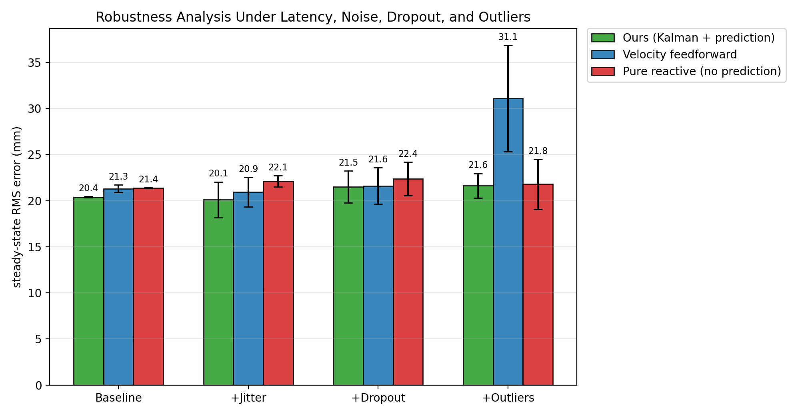
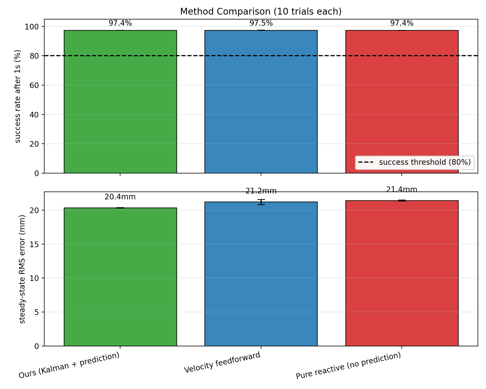
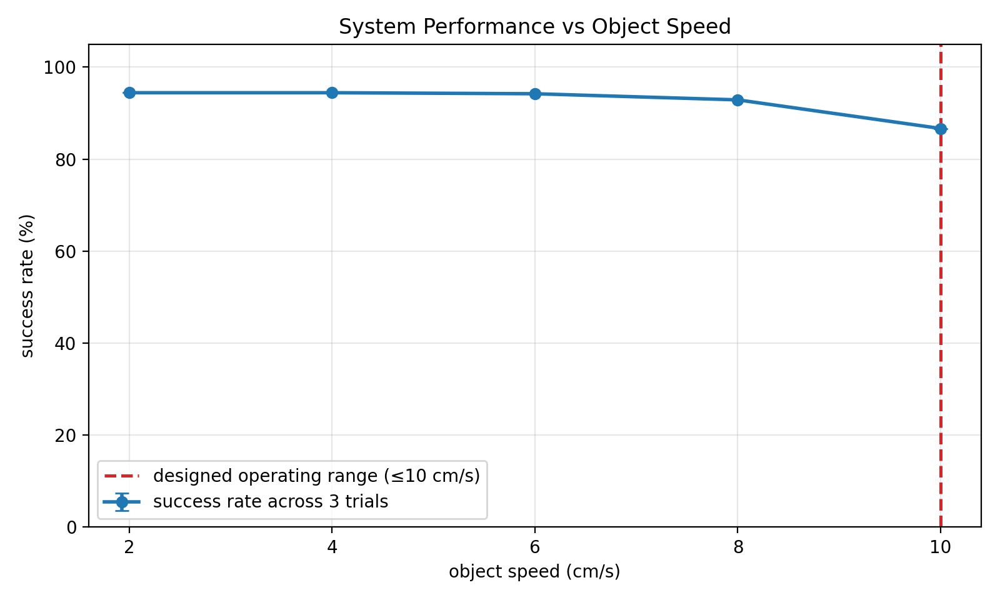
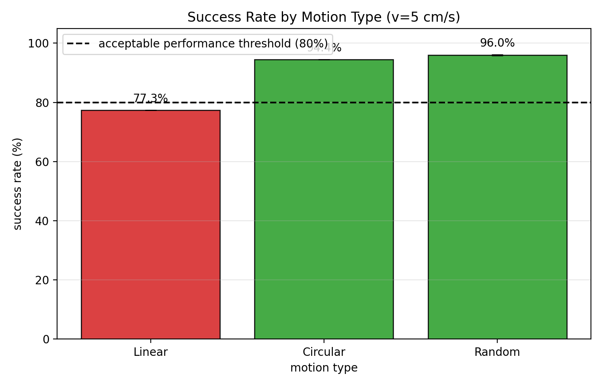
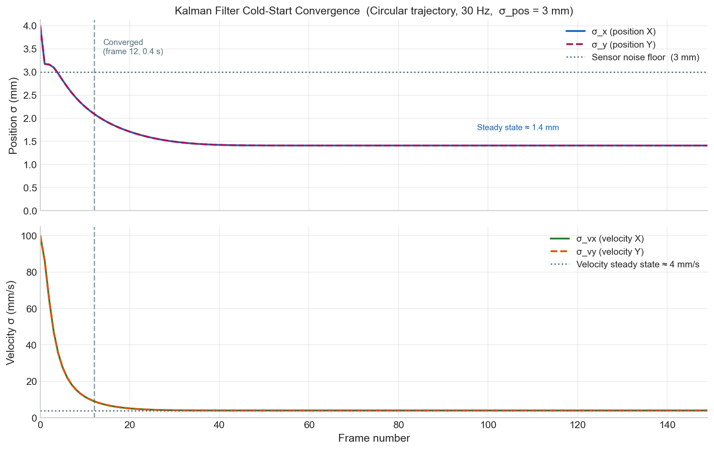
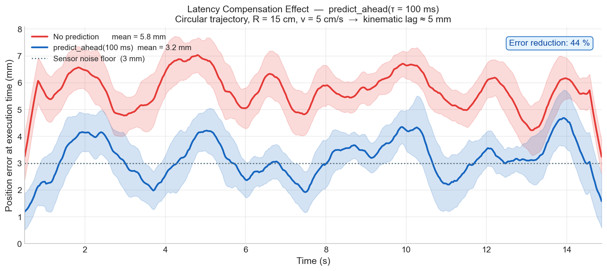
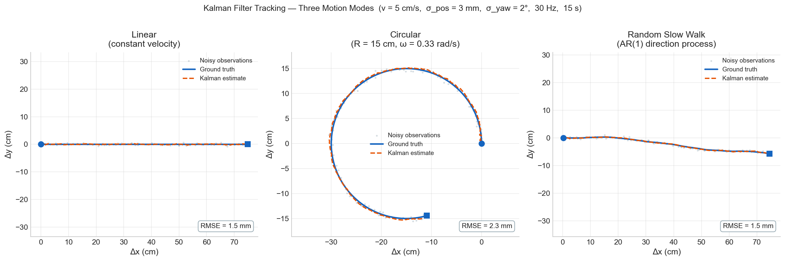
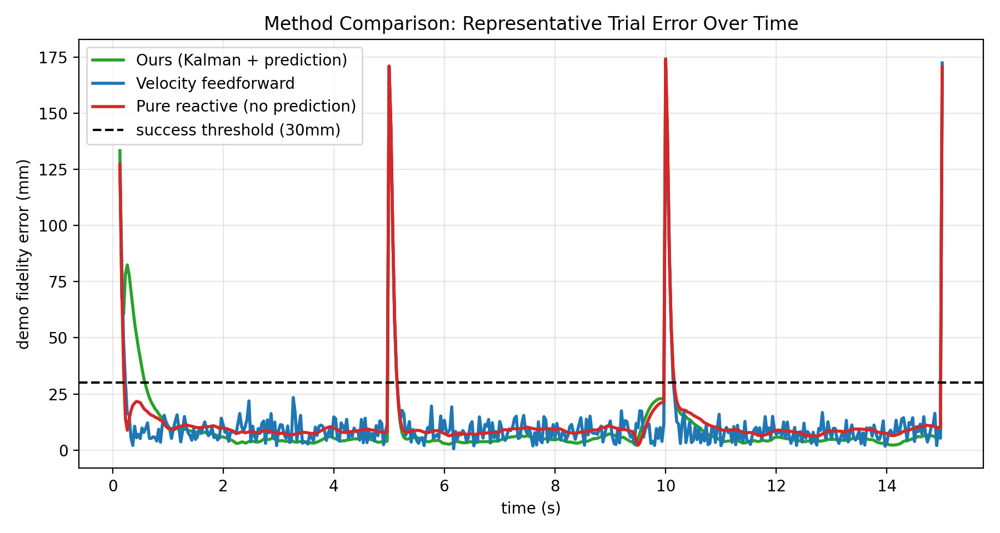

# MT3 动态对准

面向移动物体的连续目标跟踪与延迟补偿 demo replay，使静态物体上的 MT3 示教可以迁移到运动物体。

> **状态：** 核心算法已实现，并已在 PyBullet 仿真中验证。Sawyer + RealSense D415 硬件验证待完成。

## Demo


Franka Panda 使用静态物体上的抓取示教，在桌面移动物体上完成 replay。整个过程不需要重新训练。

## 核心公式

```text
T_WE_target(t) = T_delta(t + tau) · T_WE_demo(t)
```

`T_WE_demo(t)` 是 MT3 在静态物体上记录的末端执行器位姿序列。`T_delta(t + tau)` 是物体运动的延迟补偿预测，因此机器人执行的是移动物体坐标系下的原始示教，而不是追逐已经过时的观测位置。

## 关键结果

### 端到端抓取


最终抓取实验呈现倒 U 型速度响应：4-6 cm/s 是最佳工作区间；过慢时速度信号不足，过快时达到控制带宽限制。

### 延迟补偿


向前预测 100 ms 可以降低相对跟踪误差，优于纯反应式控制。

### 鲁棒性



Kalman 滤波在噪声观测下保持稳定，尤其在离群点导致 velocity feedforward 退化时优势更明显。

### 方法对比



Kalman + prediction 方法达到或超过其他控制方法，并提供更可靠的稳态表现。

<details>
<summary>完整实验结果</summary>

### Tracker 仿真


俯视 RGB-D 仿真中，tracker 可以以毫米级稳态误差跟踪圆周运动方块。

### Panda 闭环跟踪


Panda 末端执行器使用 tracker 输出，在运动物体旁维持稳定相对位姿。

### 静态示教到移动物体


在静态物体上记录的轨迹可以在移动物体坐标系中 replay。

### 速度与运动类型敏感性




系统在多种物体速度和运动模式下保持有效，但在速度反转点和高速极限附近会退化。

### 其他测试图






最终抓取实验的原始数据保存在 [`simulation/results/raw/10_grasping_final_seed42.csv`](simulation/results/raw/10_grasping_final_seed42.csv)。

</details>

## 工作原理

Tracker 估计物体相对于静态示教时的位置变化。Kalman 滤波器对这个运动估计进行平滑，并向未来预测一小段时间，用来补偿相机、计算和执行延迟。机器人随后用预测出的物体运动去变换每一帧 demo 位姿，因此同一段示教可以跟随移动物体执行。对于抓取任务，自适应 replay 会在对准较差时放慢 demo，等手臂重新对准后再继续执行。

## 模块结构

```text
MT3_dynamic_alignment/
├── dynamic_alignment/          核心实现
│   ├── types.py                共享数据结构
│   ├── motion_models.py        常速度与协调转弯运动模型
│   ├── kalman.py               Kalman / EKF 滤波器
│   ├── pose_estimator.py       点云到物体运动观测
│   └── tracker.py              主跟踪与目标位姿接口
│
├── examples/
│   └── simulate_and_plot.py    最小合成仿真示例
│
├── simulation/                 PyBullet 实验
│   ├── 02_tracker_sim.py
│   ├── 03_closed_loop.py
│   ├── 04_baseline_comparison.py
│   ├── 05_mt3_integration.py
│   ├── 06_speed_sensitivity.py
│   ├── 07_motion_type_comparison.py
│   ├── 08_method_comparison.py
│   ├── 09_robustness_analysis.py
│   ├── 10_grasping_experiment.py
│   └── results/
│       ├── plot/               图表与 demo GIF
│       └── raw/                原始实验 CSV
│
├── tests/                      无硬件依赖的单元测试
├── MT3_dynamic_alignment_notes.md
└── 2305.05926v1.pdf            MT3 论文
```

## 快速开始

创建环境：

```bash
conda create -n dynamic_mt3 python=3.11 numpy matplotlib pytest -y
conda activate dynamic_mt3
```

运行测试：

```bash
python -m pytest tests/ -v
```

运行最小仿真示例：

```bash
python examples/simulate_and_plot.py
```

PyBullet 实验还需要在同一环境中安装 `pybullet`、`pillow` 和 `imageio`。

## 与 MT3 集成

真实部署只需要替换两个感知 stub，并在控制器中切换目标位姿来源。

```python
# 1. 替换 pose_estimator.py 中的硬件 stub
PoseEstimator.get_point_cloud_from_realsense()   # RealSense SDK
PoseEstimator.segment_object_by_bbox()           # MT3 点云分割

# 2. 在 MT3/GICP 对准完成后初始化一次
tracker.init(current_cloud, initial_theta=gicp_theta, timestamp=t0)

# 3. 在控制循环中使用动态目标位姿
state = tracker.update(current_cloud, timestamp=t)
T_target = tracker.get_target_pose(demo_data, t_demo=phase_time, tau=0.1)
```

MT3 原有 demo 数据格式可以保持不变：`DemoData` 继续保存原始末端执行器位姿序列和时间戳。

## 设计说明

推导、延迟补偿分析、运动模型假设和两阶段 replay 设计见 [`MT3_dynamic_alignment_notes.md`](MT3_dynamic_alignment_notes.md)。

## 致谢

本项目将 MT3（*Multi-Task Trajectory Transfer*, Science Robotics 2025）中的静态一次性对准扩展为连续的物体相对 replay。
